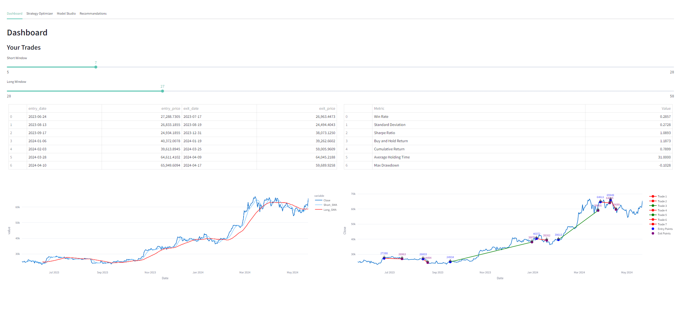
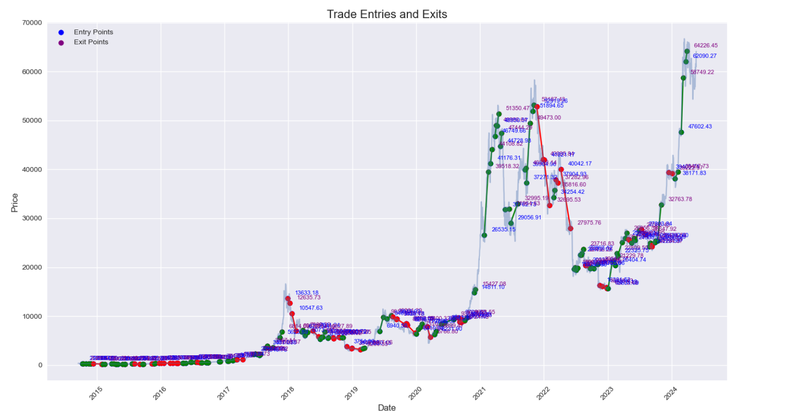
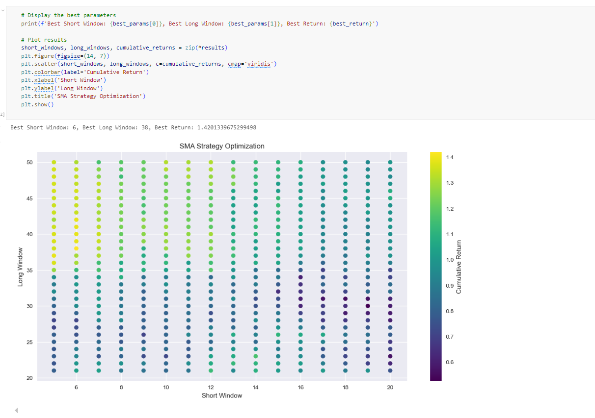

# TradingStrategy

## API period and timerange parameter

In trading we can use various indicators based on our asset price, those indicators help us to caracterise the volatility of this one,
each indicators has its own parameter that we need to optimize

# Components of a Trading Strategy

#### Indicators
Indicators are mathematical calculations based on historical price, volume, or open interest information that traders use to predict future price movements. Some common types include:
- **Trend Indicators**: Moving Averages (SMA, EMA), Moving Average Convergence Divergence (MACD)
- **Momentum Indicators**: Relative Strength Index (RSI), Stochastic Oscillator
- **Volatility Indicators**: Bollinger Bands, Average True Range (ATR)
- **Volume Indicators**: On-Balance Volume (OBV), Volume Weighted Average Price (VWAP)

**SEE NOTEBOOK NUMBER 02**

#### Entry Point
The entry point is the specific price or condition under which you decide to enter a trade. Key considerations for determining entry points include:
- **Signal from Indicators**: A buy signal from indicators like RSI below 30 (oversold conditions) or a bullish crossover in MACD.
- **Price Action**: Patterns such as breakouts, reversals, or trend continuation patterns (e.g., head and shoulders, flags, triangles).
- **Support and Resistance Levels**: Entering a trade when the price bounces off support or breaks through resistance.

#### Exit Point
The exit point is the specific price or condition under which you decide to close a trade. Key considerations for determining exit points include:
- **Signal from Indicators**: A sell signal from indicators like RSI above 70 (overbought conditions) or a bearish crossover in MACD.
- **Price Action**: Patterns indicating potential reversals or exhaustion.
- **Profit Targets and Stop Losses**: Predefined levels to take profit or limit losses, often based on technical levels (e.g., Fibonacci retracement levels) or a fixed percentage.

## Components of a Machine Learning Trading Strategy

#### Features
Features are input variables derived from historical price, volume, or other market data that a machine learning model uses to predict future price movements. Common features include:
- **Technical Indicators**: Moving Averages (SMA, EMA), Relative Strength Index (RSI), Bollinger Bands, MACD, etc.
- **Price and Volume Data**: Open, High, Low, Close prices (OHLC), Volume, VWAP.
- **Derived Metrics**: Price returns, rolling statistics (mean, variance), momentum, volatility measures.

#### Target Variable
The target variable is the outcome that the model is trying to predict. For trading strategies, common target variables include:
- **Binary Classification**: Predicting whether the price will go up or down.
- **Regression**: Predicting the future price or return.

#### Model Selection
Model selection involves choosing an appropriate machine learning algorithm to learn from historical data and make predictions. Common algorithms include:
- **Supervised Learning**: Linear Regression, Logistic Regression, Decision Trees, Random Forests, Support Vector Machines (SVM), Neural Networks.
- **Unsupervised Learning**: Clustering algorithms (K-Means), Principal Component Analysis (PCA) for feature reduction.

#### Data Preprocessing
Data preprocessing involves preparing the raw data for the machine learning model. Key steps include:
- **Data Cleaning**: Handling missing values, outliers, and duplicates.
- **Feature Engineering**: Creating new features from existing data, scaling features, encoding categorical variables.
- **Splitting the Data**: Dividing the dataset into training, validation, and test sets.

#### Model Training and Validation
Model training involves fitting the chosen machine learning algorithm to the training data. Validation involves evaluating the model's performance on a separate validation set to fine-tune hyperparameters and prevent overfitting.
- **Cross-Validation**: Techniques such as k-fold cross-validation to ensure the model generalizes well.
- **Hyperparameter Tuning**: Using grid search or random search to find the best hyperparameters for the model.

#### Model Evaluation
Model evaluation involves assessing the performance of the trained model on the test set using various metrics.
- **Classification Metrics**: Accuracy, Precision, Recall, F1 Score, ROC-AUC.
- **Regression Metrics**: Mean Absolute Error (MAE), Mean Squared Error (MSE), Root Mean Squared Error (RMSE).

#### Implementation
Implementing the trained model in a live trading environment involves:
- **Backtesting**: Simulating the strategy on historical data to evaluate its performance.
- **Paper Trading**: Testing the strategy in a simulated environment with live market data without real money.
- **Live Trading**: Deploying the strategy in a real trading environment with risk management protocols.
